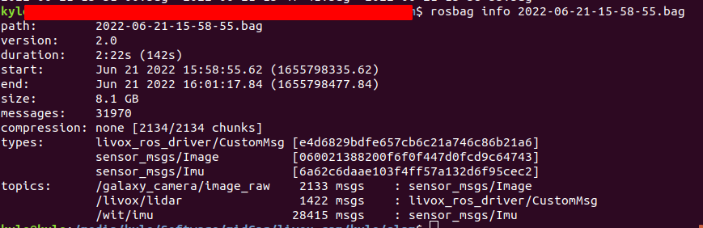
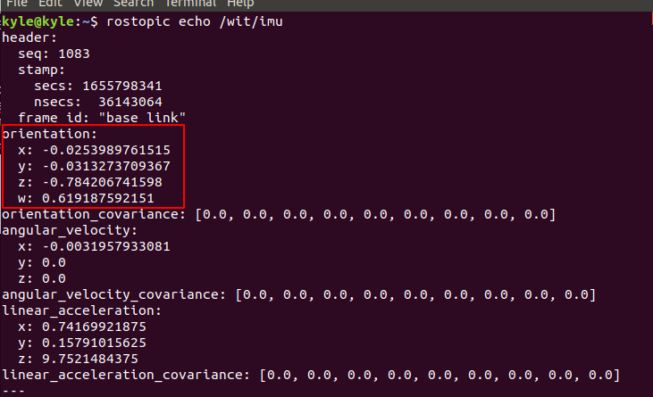
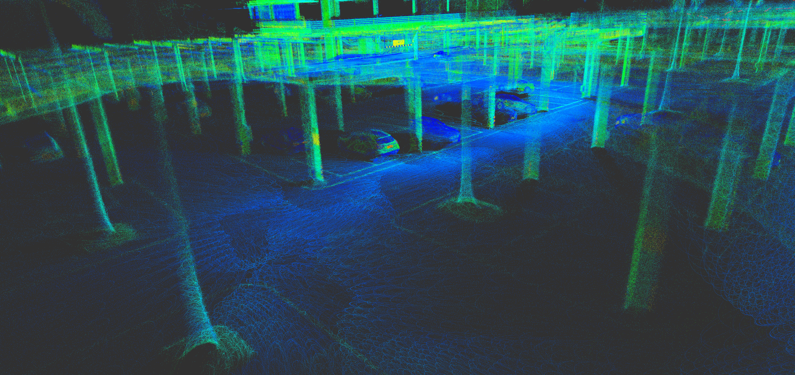
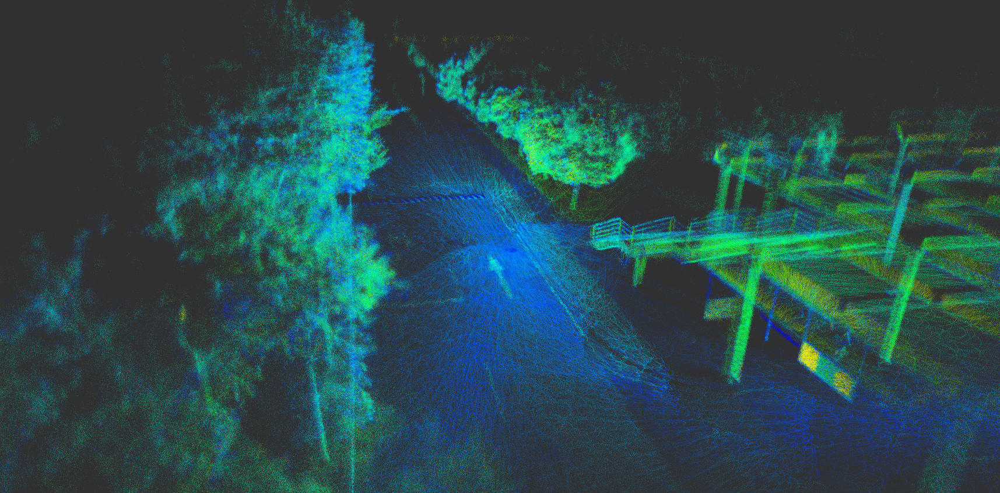

# faster_lio_sam

## INTRODUCTION


## DEPEND

1. ROS (melodic)
2. glog: `sudo apt-get install libgoogle-glog-dev`
3. eigen: `sudo apt-get install libeigen3-dev`
4. pcl: `sudo apt-get install libpcl-dev`
5. OpenCV
6. GTSAM
6. livox_ros_driver

## BUILD

- Download the package from git, and upzip the library in the thirdparty:
```
cd ~/ros/catkin_ws/src
git clone https://github.com/GDUT-Kyle/faster_lio_sam
cd faster_lio_sam/thirdparty
tar -xvf tbb2018_20170726oss_lin.tgz
```

- Upgrade the g++ compiler to 9.0 or higher by:

```
sudo add-apt-repository ppa:ubuntu-toolchain-r/test
sudo apt update
sudo apt install gcc-9
sudo apt install g++-9
cd /usr/bin
sudo rm gcc g++
sudo ln -s gcc-9 gcc
sudo ln -s g++-9 g++
```
- Compile with catkin build
```
catkin build faster_lio_sam
```

## RUN

### 1. Prepare your `rosbag`

Using Livox's custom message types



**IMU messages must contain attitude information !!!**



### 2. Set calibration parameters

**!!! In the current version, the extrinsic transformation matrix between LiDAR and IMU is the identity matrix . (The extrinsic transformation part in the code will be corrected as soon as possible ~~~)**

### 3. Set LiDAR parameters

Livox Mid-70

```
lidar0:
  N_SCAN: 1
  Horizon_SCAN: 10000
  lidarMinRange: 1.0
  lidarMaxRange: 200.0
```

### 4. Launch

```
roslaunch faster_lio_sam run.launch
rosbag play [YOUR_ROSBAG] --clock
```

## RESULT







## THANKS

[FAST_LIO](https://github.com/hku-mars/FAST_LIO)

[faster-lio](https://github.com/gaoxiang12/faster-lio)

[loam_velodyne](https://github.com/laboshinl/loam_velodyne)

[LIO-SAM](https://github.com/TixiaoShan/LIO-SAM)

[livox_mapping](https://github.com/Livox-SDK/livox_mapping)

[LINS---LiDAR-inertial-SLAM](https://github.com/ChaoqinRobotics/LINS---LiDAR-inertial-SLAM)
