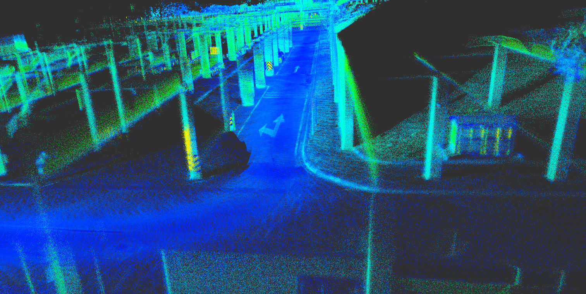
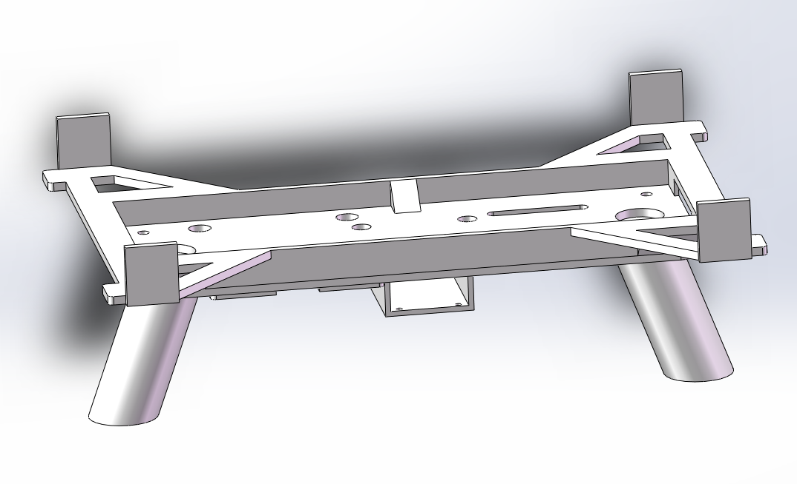
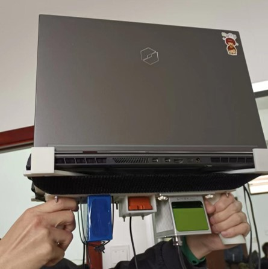
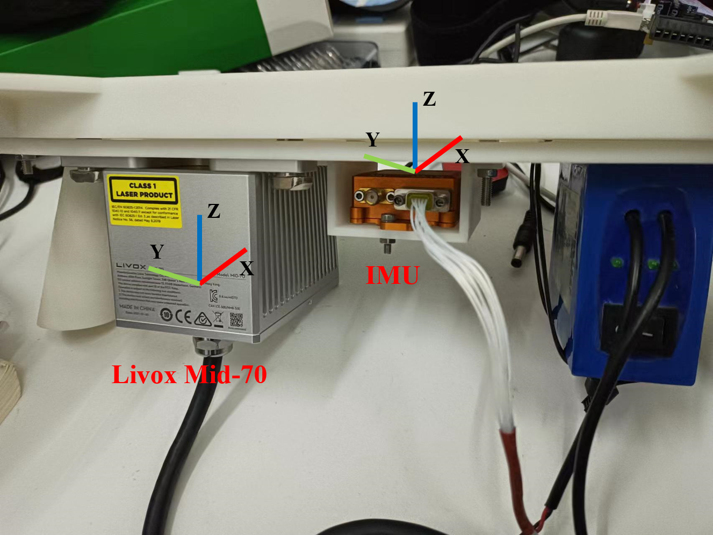
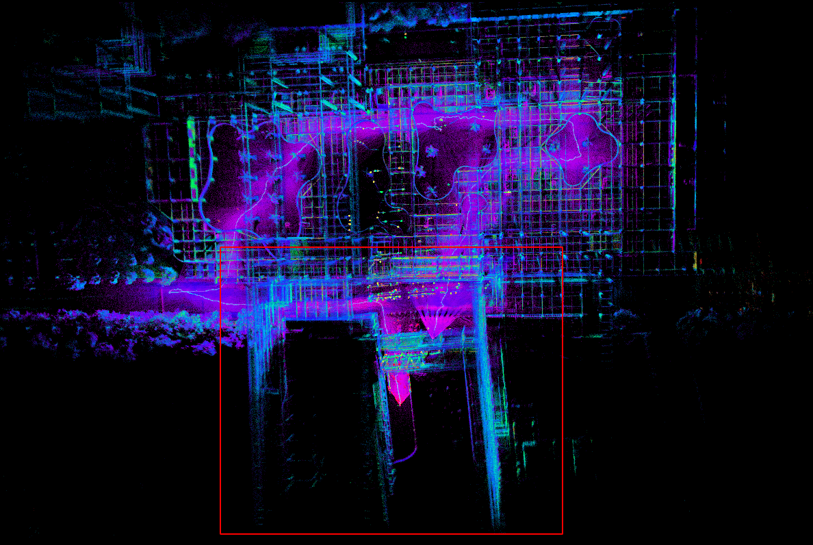

# faster_lio_sam




## INTRODUCTION

A real-time Livox LiDAR+IMU odometry package. Our main work is to redesign an efficient and accurate SLAM scheme based on the excellent ideas of **[FAST_LIO](https://github.com/hku-mars/FAST_LIO)/[faster-lio](https://github.com/gaoxiang12/faster-lio)/[LIO-SAM](https://github.com/TixiaoShan/LIO-SAM)**. The specific steps of the system are as follows:

1. `ImageProjection.cpp`: Undistort scan using IMU measurements and high frequency odometry information.
2. `fusionOptimization.cpp`: Fusion of LiDAR and IMU based on iterative error state Kalman filter (IESKF) and iVox to estimate global state (PVQ).
3. `imuPreintegration.cpp`: Based on ISAM2, the IMU pre-integration factor and the odometry factor are used to jointly estimate the bias of the IMU.
4. `Pose Optimazation`: This function is not included in this project, we recommend users to refer to **[livox_backend](https://github.com/GDUT-Kyle/livox_backend)**. The mentioned project uses a distance-based loop closure detector for global pose graph optimization.

<p align='center'>
    
    
</p>


<table rules="none" align="center">
	<tr>
		<td>
			<center>
				
				<br/>
				<font color="AAAAAA">faster-lio</font>
			</center>
		</td>
		<td>
			<center>
				
				<br/>
				<font color="AAAAAA">[ours] faster_lio_sam</font>
			</center>
		</td>
	</tr>
</table>

## Demo video

[PARKING LOT](https://www.bilibili.com/video/BV19F411F7mR?spm_id_from=333.999.0.0&vd_source=5cb4af9a8739369e1b405a4fd42e8b80)

[OPEN SPACE](https://www.bilibili.com/video/BV1cF411V7XX?spm_id_from=333.999.0.0&vd_source=5cb4af9a8739369e1b405a4fd42e8b80)

## DEPEND

1. ROS (melodic)
2. glog: `sudo apt-get install libgoogle-glog-dev`
3. eigen: `sudo apt-get install libeigen3-dev`
4. pcl: `sudo apt-get install libpcl-dev`
5. OpenCV
6. GTSAM
7. livox_ros_driver

## BUILD

- Download the package from git, and upzip the library in the thirdparty:

```bash
cd ~/ros/catkin_ws/src
git clone https://github.com/GDUT-Kyle/faster_lio_sam
cd faster_lio_sam/thirdparty
tar -xvf tbb2018_20170726oss_lin.tgz
```

- Upgrade the g++ compiler to 9.0 or higher by:

```bash
sudo add-apt-repository ppa:ubuntu-toolchain-r/test
sudo apt update
sudo apt install gcc-9
sudo apt install g++-9
cd /usr/bin
sudo rm gcc g++
sudo ln -s gcc-9 gcc
sudo ln -s g++-9 g++
```

- Compile with catkin build

```bash
catkin build faster_lio_sam
```

## RUN

### 1. Prepare your `rosbag`

Using Livox's custom message types


**!!! [IMU messages must contain attitude information]() !!!**

**!!! [IMU消息必须包含姿态信息]()) !!!**


### 2. Set calibration parameters

**!!! In the current version, the extrinsic transformation matrix between LiDAR and IMU is the identity matrix . (The extrinsic transformation part in the code will be corrected as soon as possible ~~~)**

### 3. Set LiDAR parameters

Livox Mid-70

```yaml
lidar0:
  N_SCAN: 1
  Horizon_SCAN: 10000
  lidarMinRange: 1.0
  lidarMaxRange: 200.0
```

### 4. Launch

```bash
roslaunch faster_lio_sam run.launch
rosbag play [YOUR_ROSBAG] --clock
```

## RESULT


## THANKS

[FAST_LIO](https://github.com/hku-mars/FAST_LIO)

[faster-lio](https://github.com/gaoxiang12/faster-lio)

[loam_velodyne](https://github.com/laboshinl/loam_velodyne)

[LIO-SAM](https://github.com/TixiaoShan/LIO-SAM)

[livox_mapping](https://github.com/Livox-SDK/livox_mapping)

[LINS---LiDAR-inertial-SLAM](https://github.com/ChaoqinRobotics/LINS---LiDAR-inertial-SLAM)
